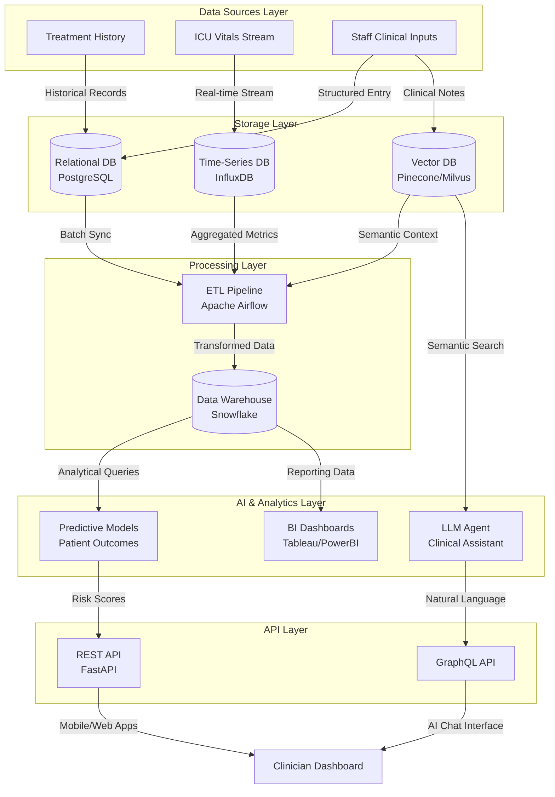

# Healthcare Analytics Platform - Architecture Diagram

## System Architecture Overview

## Component Description

| Layer | Component | Purpose |
|-------|-----------|--------|
| Sources | Treatment History | Historical patient records, medications, procedures |
| Sources | ICU Vitals Stream | Real-time physiological data from ICU monitors |
| Sources | Staff Inputs | Clinical notes, diagnoses, care plans |
| Storage | Relational DB | Structured patient records with ACID compliance |
| Storage | Time-Series DB | High-frequency vital signs with temporal queries |
| Storage | Vector DB | Semantic search over clinical documentation |
| Processing | ETL Pipeline | Data cleaning, transformation, and orchestration |
| Processing | Data Warehouse | Aggregated data for reporting and ML training |
| AI | Predictive Models | Patient deterioration, readmission risk |
| AI | LLM Agent | Natural language clinical assistant |
| API | REST/GraphQL | Secure access to all data services |
